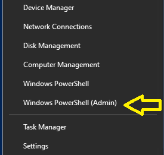

author: Jumail Bin Taliba
last updated: December 14 2023
summary: Chocolatey Installation
id: codelab-chocolatey-installation
categories: codelab,markdown
environments: Web
status: Published

# Software Installation on Windows Using Chocolatey

## About this Codelab

Duration: 0:01:00

***Jumail (jumail@utm.my) |  December 14, 2023***

This codelab will walk you through about how to use Chocolatey installation manager to install softwares on Windows.

<aside class="negative">

The installation is only for Windows machine

</aside>

<aside class="positive">

- Prepared by: Jumail (jumail@utm.my)
- Date: December 14, 2023

</aside>

## Installation of Chocolatey

Duration: 0:1:00

`Chocolatey` is a third-party tool. So we need to install it first.

### Open a Poweshell Terminal as `Administrator`

- `Right click` the Windows Icon. to open Windows menu.

- Click on `Windows Powershell(Admin)`



### Install Chocolatey

- In the Powershell Terminal, run the following commands:

   ```powershell
   Set-ExecutionPolicy Bypass -Scope Process -Force; [System.Net.ServicePointManager]::SecurityProtocol = [System.Net.ServicePointManager]::SecurityProtocol -bor 3072; iex ((New-Object System.Net.WebClient).DownloadString('https://community.chocolatey.org/install.ps1'))
   ```

- Test chocolatey installation

   ```powershell
   choco --version

   # If the chocolatey successfully installed, you should see the version.
   ```

### Links

- [Chocolatey Installation](https://chocolatey.org/install)
- [Find Package on Chocolatey](https://community.chocolatey.org/packages)

## Installation of Softwares

Duration: 0:12:00

Once chocolatey got installed on your machine, next you can install you prefered softwares following the syntax:

 ```powershell
 choco install softwareName1, softwareName2, softwareName3,... -y

 ```

# Here is some of softwares that you may want to install:

| Software              | Software Name  | Type                  |
|-----------------------|----------------|-----------------------|
| Visual Studio Code    | `vscode`       | Development Tools     |
| Git                   | `git`          | Development Tools     |
| Flutter SDK           | `flutter`      | Mobile App Development|
| Android Studio        | `android-studio` | Mobile App Development|
| Spring Tool Suites    | `sts`            | Integrated Development|
| Maven                 | `maven`          | Build Automation      |
| 7zip                  | `7zip`          | Compression Utilities |
| Node.js               | `node`         | Programming           |
| C++                   | `mingw`         | Programming           |
| Java Development Kit  | `openjdk`       | Programming           |


# Example: To install softwares for Mobile Application Development.

 ```powershell
 choco install vscode git flutter openjdk androidstudio -y
 ```

<aside class="negative">

### Open A New Powershell Session

The above installations may have changed the `Environement Variables` of your system such as the `PATH`. To allow the changes to take effect, open a new powershell session.
</aside>

## Installation of VS Code Extenstions

Duration: 0:02:00

In this step onwards, you are expected to work on the newly opened Powershell terminal. You can install VS Code Extensions from the VS Code. However, in this step we are going to do that using command-line in powershell terminal.

### Common Extenstions Recommended to install:

-   Error Lens *(Show error at coding-time)*
-   Better Comments *(comments with colors)*
-   Colonize *(add semicolon)*
-   Live Share *(for collaborative coding)*
-   Peacock


Example:

Run the following commands in Powershell one line at a time.

```powershell
 # Flutter

 # Error Lens
 code --install-extension PhilHindle.errorlens
 
 # Pubspec Assist
 code --install-extension jeroen-meijer.pubspec-assist

 # Colonize
 code --install-extension vmsynkov.colonize

 # Better Comments
 code --install-extension aaron-bond.better-comments

 # Firebase
 code --install-extension toba.vsfire
 ``
